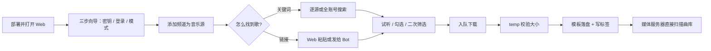

<p align="center">
  
</p>

<h1 align="center">telegram-musicdown</h1>

> 面向个人曲库的 Telegram 音乐下载器：搜索频道音频、粘贴链接或发给 Bot，按模板落盘并写入标签。

<p align="center">
  <strong>Local-first · Template-driven · Single process</strong>
</p>


telegram-musicdown 是一个单进程的 Telegram 音乐下载工具：FastAPI 后端 + Kurigram（Pyrogram 分支）客户端 + Svelte 5 Web 控制台。它把已加入的 Telegram 频道当作音乐源，支持关键词搜索、链接解析和 Bot 下单；下载按 `{artist}/{album}/{title}` 模板落盘，用 mutagen 写入 ID3/Vorbis 标签，媒体服务器可以直接扫描曲库目录。

它不是公开互联网的流媒体服务，也不做频道历史同步：入库只由搜索、链接和 Bot 三条手动路径触发。

## 为什么做 telegram-musicdown

参考项目（tangyoha/telegram_media_downloader）的「前缀列表」命名无法表达 `{artist}/{album}/{title}` 目录结构，配置页也不能在浏览器里完成登录。本项目围绕三个问题重做：

- **命名即模板**：目录模板与文件名模板独立配置，`{album}` 缺失时该目录段省略，不生成 `Unknown Album` 文件夹；非法路径字符清洗、Windows 保留名与路径长度上限都有处理。
- **初始化全在 Web**：首次部署 `docker compose up -d` 后，浏览器三步向导走完——密钥与代理、手机号验证码登录、搜索模式选择；校验不通过不写 `config.yaml`，待修项一次列全。
- **限流可见**：搜索逐源并发取数（默认 4，避免把账号打进 FloodWait），超窗的源转后台补齐并点名提示，绝不静默截断；下载按 FloodWait 秒数挂起单个 worker，其余不受影响。

## 亮点一览

| 方向 | 本项目提供的能力 |
| --- | --- |
| 音乐源 | 已加入的 Telegram 频道/群组添加为源，`@username`、`t.me` 链接、数字 id 三种输入；只加源不拉历史 |
| 搜索 | 逐源模式（按频道分门别类，单源失败只影响该源）与全账号模式（`messages.searchGlobal`，不需要频道源）；匹配字段可勾选，服务端执行筛选与排序 |
| 在线音乐源 | 可接入 ChKSz（可自建）覆盖网易云 / QQ 音乐 / 酷狗三个平台，逐平台启停，下载与试听可指定音质档位 |
| 链接下载 | `t.me/c/...`、`t.me/user/msg`、评论区消息、`tg://` 等价形式；相册与连续音频可展开；Web 粘贴与 Bot 下单同一队列 |
| Bot | `/download`（消息 id 范围）、`/status`、`/cancel`；转发或直接上传音频给 Bot 按模板保存，不依赖频道源配置 |
| 下载引擎 | SQLite 持久化队列，断点续传、大小校验（有 `file_size` 时必须一致）、失败自动重试（指数退避，FloodWait 等到期再试）、三种去重判据 |
| 模板落盘 | `{title}` / `{artist}` / `{album}` / `{track}` 等占位符 + 简单过滤器（`{track:02d}`、`{caption:truncate:80}`）；实时预览渲染路径 |
| 标签 | 下载后 mutagen 写 ID3/Vorbis/MP4 标签，可选嵌入封面；失败只记日志不标任务失败 |
| 试听 | 搜索结果先听再下，写入独立缓存（LRU，上限可配），试听与下载互不阻塞 |
| Web 控制台 | 仪表盘 / 搜索 / 下载 / 音乐源 / 设置 / 日志；中英双语、浅色/深色主题、响应式（390px 可用）；全局播放条 |
| 部署 | 单进程 Python 服务，Docker 多阶段构建；前端产物在构建时现场生成 |

## 一次典型的下载流程



## 快速开始

### Docker 部署（推荐）

```bash
# 只取 compose 文件（无需克隆仓库）
curl -O https://raw.githubusercontent.com/kato358/telgram_musicdown/main/docker-compose.yml
docker compose up -d
```

浏览器打开 `http://127.0.0.1:8787`，`/setup` 向导三步走完：

1. **密钥与代理**：`api_id` / `api_hash` 来自 [my.telegram.org](https://my.telegram.org/apps)；`bot_token` 可选（来自 [@BotFather](https://t.me/BotFather)，留空则仅用户登录）；代理可选（SOCKS5 / HTTP，User 与 Bot 共用）。
2. **登录账号**：手机号（带国家码）+ 验证码；开启 2FA 时按需输入云密码。会话文件生成在数据目录，仅当前用户可读。
3. **搜索模式**：逐源搜索（默认，需要音乐源）或全账号搜索（不需要音乐源）。可跳过，之后在「音乐源」页补。

放行判据 = 密钥齐备 + 已登录；未满足时其余页面不可达。音乐源可以随时在控制台补。

数据目录需要挂载持久化，密钥写入容器内 `/data/config.yaml`，未挂卷则随容器重建丢失：

```yaml
services:
  musicdown:
    image: ghcr.io/kato358/telgram_musicdown:latest
    container_name: musicdown
    restart: unless-stopped
    ports:
      - "8787:8787"
    environment:
      - TGM_WEB_HOST=0.0.0.0
      - TGM_WEB_PORT=8787
      - TGM_BASE_DIR=/data
    volumes:
      - ./downloads:/data/downloads   # 曲库落盘
      - ./data:/data/data             # TG 会话 + 缓存 + 日志 + SQLite
      # - ./config.yaml:/data/config.yaml  # 可选：持久化密钥文件
```

镜像已发布到 GHCR：`ghcr.io/kato358/telgram_musicdown:latest`；`docker compose up -d` 会自动拉取，也可 `docker pull ghcr.io/kato358/telgram_musicdown:latest`。
镜像以非 root 用户（`tgm`，`useradd` 默认分配 UID/GID）运行，宿主机挂载目录需允许该用户读写。

### 本地运行（开发）

```bash
# Windows 开发环境一键脚本：依赖检查 + 前端构建 + 启动
python run.py

# 或手动
pip install fastapi uvicorn pydantic kurigram mutagen pyyaml httpx
cd web && pnpm install && pnpm build && cd ..
python -m app
```

默认绑定 `127.0.0.1:8787`；改为 `0.0.0.0` 时强制要求设置 `web_login_secret`。

### config.yaml 参考

复制 `config.yaml.example` 后填写；同名 `TGM_*` 环境变量优先级更高。

| 配置键 | 默认值 | 说明 |
| --- | --- | --- |
| `api_id` / `api_hash` | 空（必填） | [my.telegram.org](https://my.telegram.org/apps) 申请 |
| `bot_token` | 空 | 可选；留空则仅用户登录，Bot 下单不可用 |
| `chksz_api_key` / `chksz_base_url` | 空 / `https://api.chksz.com` | 可选在线音乐源；不填走官方默认地址 |
| `web_host` / `web_port` | `127.0.0.1` / `8787` | Web 控制台监听地址 |
| `web_login_secret` | 空 | 登录口令；非 `127.0.0.1` 绑定且未设口令时强制登录 |
| `web_login_enabled` | `true` | `false` 显式关闭登录（含 `0.0.0.0`），自行承担暴露面 |
| `save_directory` | `downloads` | 曲库根目录，相对 `TGM_BASE_DIR` |
| `session_directory` / `temp_directory` | `data/sessions` / `data/temp` | 会话与临时/试听缓存目录 |
| `proxy.enable_proxy` 等 | 关 | SOCKS5 / HTTP 代理，User 与 Bot 共用 |

## Telegram 平台硬约束

1. **搜索不是全网搜歌**。逐源模式只能搜已添加为音乐源的对话；全账号模式搜账号已加入的全部对话，仍搜不到没加入的。
2. **私有频道必须先用该账号加入**，否则链接解析失败。
3. **Bot 无法代替 User Client 扫频道**。无 User 登录时，Bot 只能处理转发到它的音频文件本身。
4. 下载受 Telegram 速率与洪水限制；并发默认 3，超限排队与退避。
5. 大文件（>2GB，视账号类型）可能失败，记录错误而非静默丢弃。

## 项目结构

```text
app/
├── __main__.py          # 入口：装配、启动 FastAPI + TG 客户端
├── config.py            # config.yaml/.env 加载：密钥/部署路径与业务配置分离
├── container.py         # 组合根：客户端/仓储/服务装配与生命周期收口
├── domain.py            # 核心域类型与纯规则：TrackMeta、模板配置、筛选/排序
├── db/                  # SQLite 表定义、顺序迁移、仓储层（全部 SQL 收口于此）
├── ports/               # 依赖倒置的抽象侧；服务只依赖端口，不依赖适配器
├── telegram/            # Kurigram 适配器：User/Bot 客户端、FloodWait 退避
├── chksz/               # 在线源适配器：HTTP 客户端、音质阶梯、协议实现
├── services/            # 搜索编排、下载队列、模板渲染、试听缓存、初始化
├── web/                 # FastAPI 路由与 cookie 会话
└── utils/               # 文件名清洗、链接解析、平台判定
web/                     # Svelte 5 + Tailwind 4 + shadcn-svelte 控制台
docs/                    # 需求、设计与编码规范文档
```

依赖方向：`web → services → ports ← adapters（db / telegram / chksz）`。前端构建产物在 `web/dist`，不进 git。

## 开发

```bash
python run.py run     # 一键启动（依赖检查 + 前端构建 + 服务）
python run.py build   # 构建前端产物
python run.py test    # pytest
python run.py lint    # ruff check + mypy --strict
```

后端 `mypy --strict` 全量覆盖 `app/`；测试套件覆盖 unit / service / api 三层，fakes 隔离外部依赖，真实 Telegram 与 ChKSz 凭据不进仓库。

## 安全说明

- session、`api_hash`、`bot_token`、Web 密码不进 git（NFR-02）；`config.yaml` 与 `data/` 已在 `.gitignore`。
- 手机号与验证码只走本机服务，不写日志。
- Web 默认本机监听；音频流与标签 API 需会话，禁止目录遍历。
- `data/` 目录包含 Telegram 会话文件与下载数据库，请视为敏感配置并限制访问权限。

音乐文件、歌词、封面及外部数据源返回内容的版权和服务条款不因本项目许可证而改变，使用时请自行获得必要授权并遵守相应条款。

## 灵感与参考

本项目产品边界与实现思路参考了以下开源项目，但没有复制它们的页面资产或业务代码：

- [tangyoha/telegram_media_downloader](https://github.com/tangyoha/telegram_media_downloader)：Telegram 音乐下载的产品原型与命令语义（`/download` 消息 id 范围等）
- [Kurigram](https://github.com/KurimuzonAkuma/pyrogram)：Telegram MTProto 客户端（Pyrogram 分支）
- [FastAPI](https://github.com/fastapi/fastapi)：异步 Web 框架与 SSE/WS 进度推送
- [shadcn-svelte](https://github.com/huntabyte/shadcn-svelte)：可改写的可访问 UI 组件

## 许可证

尚未选择许可证。发布前会补充 LICENSE 文件；在此之前仓库内容默认保留所有权利。
