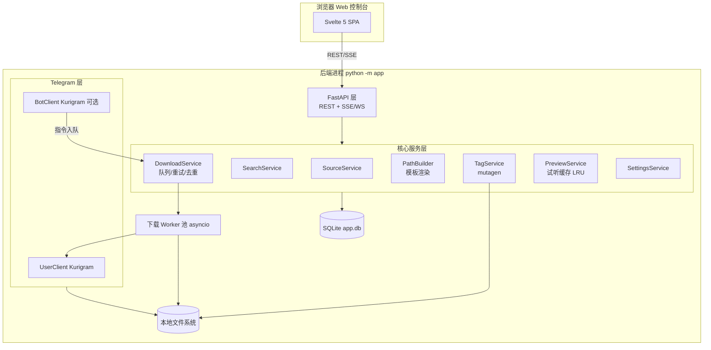

# Telegram 音乐下载器 — 软件开发文档（SDD）

| 项 | 内容 |
| --- | --- |
| 文档版本 | v1.14（浏览器下载：搜索结果的第二颗下载键把这首取回 `data/temp/browser/` 再以附件推给浏览器，token 在 TTL 内可重复取、由 TTL 与并存上限回收，不入队不写历史；新增 `app/services/browser_download.py` 与 `/api/search/browser-download` 两条路由；上游对齐 SRS v0.18） |
| 上游文档 | 《软件需求文档（SRS）》v0.18（2026-09-28，已锁定） |
| 日期 | 2026-09-28 |
| 项目代号 | `telgram_musicdown` |
| 读者 | 实现人员、测试人员 |

本文档将 SRS v0.7 的每条 FR/NFR 映射到具体模块、数据表、接口与测试点。选型与范围以 SRS 第 14 节「已锁定决策」为准，本文档不重复论证，只给实现方案。

---

## 1. 系统架构

### 1.1 总体结构

单进程 Python 应用，内嵌 Web 静态资源。三个常驻协程组：FastAPI 服务、Telegram User Client、（可选）Bot Client，共享同一 SQLite 库与下载队列。Linux + Docker 为主运行环境；首次部署后在 Web `/setup` 向导内完成密钥配置与 Telegram 登录（FR-OPS-02，§6）。



### 1.2 模块划分（目录结构）

```
app/
├── __main__.py          # 入口：装配、启动 FastAPI + TG 客户端（TGM_BASE_DIR 支持 Docker 卷布局）
├── appsettings.py       # settings 表现读的配置装配（缺省值集中管理，FR-CFG-03）
├── config.py            # config.yaml/.env 加载：密钥/部署路径与业务配置分离（FR-CFG-01/02）
├── container.py         # 组合根：Overrides → Container（客户端/仓储/服务装配与生命周期收口）
├── domain.py            # 核心域类型与纯规则：TrackMeta、模板配置、音频判定、筛选/排序
├── errors.py            # AppError 层次（code 进错误包络，NFR-08）
├── events.py            # 进程内事件总线（SDD §1.4）
├── registry.py          # SourceRegistry：音乐源频道 + 在线源拉平成一份可搜清单（§2.7）
├── db/
│   ├── models.py        # SQLite 表定义（见 §3）
│   ├── migrations/      # NNN_*.sql 顺序迁移
│   └── store/           # 仓储层，全部 SQL 收口于此；按聚合拆模块，Store 继承各 mixin
│       ├── base.py      # 连接 / 迁移 / utcnow
│       ├── sources.py   # SourceStore：音乐源 CRUD
│       ├── history.py   # HistoryStore：下载历史
│       ├── tasks.py     # TaskStore：任务台账与恢复
│       ├── library.py   # LibraryStore：本地曲库台账
│       ├── settings.py  # SettingsStore：键值设置
│       ├── preview.py   # PreviewStore：试听缓存
│       ├── search_cache.py  # SearchCacheStore：搜索二级缓存 L2
│       └── stats.py     # StatsStore：统计聚合
├── ports/               # 依赖倒置的抽象侧（DIP）；服务只依赖端口，不依赖适配器
│   ├── music.py         # MusicSourceProto / MusicSourceIndexProto（§2.7）
│   ├── repository.py    # IStore 及其按聚合拆分的子协议（ISP）
│   └── telegram.py      # Dialog/Search/Media 三个客户端协议面
├── chksz/               # 在线源适配器：client（HTTP）/ quality（音质阶梯）/ source（协议实现）
├── telegram/
│   ├── manager.py       # TelegramManager：User/Bot Client 生命周期与依赖注入代理
│   ├── user_client.py   # UserClient：登录、搜索
│   ├── media.py         # 两个会话共用的取消息/下载动作 + Kurigram 异常翻译
│   ├── music_source.py  # 音乐源频道适配器（MusicSourceProto 的 Telegram 实现）
│   ├── bot_client.py    # BotClient：命令/链接/转发处理（FR-LINK-03/04）
│   ├── unconnected.py   # 未登录占位客户端（装配缺省，调用即 not_connected）
│   └── flood.py         # FloodWait 统一退避包装（NFR-09）
├── services/
│   ├── source.py        # FR-SRC-01~05 音乐源增删改查与候选发现
│   ├── search.py        # FR-SEARCH-01~04 搜索编排：并发扇出 + 同步窗口
│   ├── search_cache.py  # 搜索二级缓存（L1 内存 LRU + L2 SQLite），SDD §2.6
│   ├── download.py      # FR-DL-01~06 队列引擎（入队即建 history 行）
│   ├── history_writer.py # 历史行结算（展示字段/读数/终态）
│   ├── progress.py      # 进度上报与任务运行态（暂停/取消标记）
│   ├── local_library.py # FR-LIB 本地曲库扫描
│   ├── path_builder.py  # FR-NAME-01~07 模板渲染
│   ├── tags.py          # FR-META-01、FR-TAG-01~03
│   ├── preview.py       # FR-PLAY-01~03 试听与封面缓存
│   ├── browser_download.py # FR-DL-08 浏览器下载：取回临时区 + 一次性 token（§2.8）
│   └── setup.py         # FR-OPS-02 首次部署初始化：密钥写入 config.yaml
├── web/
│   ├── routes/          # §5 的路由实现（context 传共享上下文，presenters 纯序列化）
│   └── auth.py          # cookie 会话（FR-WEB-02）
└── utils/
    ├── sanitize.py      # 文件名清洗、Windows 保留名、路径截断（FR-DL-03）
    ├── linkparse.py     # t.me/tg:// 链接解析（FR-LINK-01）
    ├── platform.py      # 平台判定（reveal 等平台相关行为）
    └── proactor_patch.py # Windows Proactor 连接关闭噪音抑制
```

依赖方向：`web → services → ports ← adapters（db / telegram / chksz）`；services 之间禁止互相 import，跨服务协作通过 DownloadService 的入队接口、事件总线（§1.4）与组合根注入的 SourceRegistry。
前端构建产物在仓库根的 `web/dist`（`TGM_STATIC_DIR` 可改指），不在 `app/web/` 下。

### 1.3 并发模型

| 执行单元 | 机制 | 上限 | 来源 |
| --- | --- | --- | --- |
| 下载 Worker 池 | `asyncio.Semaphore`，每 worker 一次 Kurigram `download_media` | 默认 3，可配，UI 警告 >5（FR-DL-01） | `max_download_task` |
| 预览槽 | 独立信号量 | 1（FR-PLAY-03） | 固定 |
| FloodWait | 包装器捕获 `FloodWait`，按服务端给的秒数（Kurigram 的 `FloodWait.seconds`）挂起该 worker 后重试，其余 worker 不受影响 | — | NFR-09 |

关键点：Kurigram 客户端在同一个 asyncio loop 内运行；FastAPI（uvicorn）与 Kurigram 共享 loop，由 `__main__.py` 统一 `asyncio.run` 启动，避免双 loop。

### 1.4 进程内事件总线

一个简单的 `asyncio.Queue` 广播器，供 SSE `/api/events` 使用。事件类型：

| 事件 | 载荷 | 消费方 |
| --- | --- | --- |
| `task.progress` | task_id, progress_bytes, total_bytes, speed, eta | Web 进度（FR-DL-02） |
| `task.status` | task_id, status, error | Web、Bot 回复（FR-LINK-03）、完成通知（FR-NOTIFY-01） |
| `log.error` | message, ts | 日志页（FR-WEB-01） |
| `preview.ready` | preview_id | 试听（FR-PLAY-02） |
| `session.invalid` | — | 顶栏重登提示（FR-AUTH-02） |

### 1.5 恢复流程（NFR-05）

启动时扫描 `tasks` 表：
- `queued` → 保持，重新入队。
- `downloading` → 标记 `failed`（error=`interrupted, retryable`），保留临时文件，可手动/自动重试（断点续传 FR-DL-06 生效时优先续传）。
- 其余状态不动。
- **历史行结算**：状态非终态（`queued`/`downloading`/`paused`）却已经没有任何在跑任务的 `history` 行，一并结算为 `failed`（error=`interrupted, retryable`）——状态事实源是历史行（§3.2），重启后不留「永远等待」的行。
- `sources`、`history`、`settings` 均在库中，无需重建。

---

## 2. 关键技术方案

### 2.1 Telegram 交互

| 功能 | 实现 | 对应 FR |
| --- | --- | --- |
| 登录 | Web `/setup` 向导：`POST /api/setup/secrets` 保存密钥到 config.yaml → `POST /api/auth/telegram/send-code`（UserClient connect + send_code；已有有效会话直接返回 `authorized:true`）→ `sign-in`（2FA 缺密码抛 `password_required`，前端据此展开密码框）。错误码：`secrets_missing`/`phone_invalid`/`code_invalid`/`code_expired`/`password_invalid`/`connect_failed`（连不上 Telegram 含当前代理地址与修复方向）。session 文件落 `sessions/`，权限仅当前用户可读。连接带 30s 硬超时（Kurigram 会话启动对网络失败是无限重试，不能让它挂住 Web 请求）；启动期连不上只记警告，由向导修配置 | FR-AUTH-01 |
| 对话内搜索 | `client.search_messages(chat_id, limit, offset, query, filter=MessagesFilter.AUDIO)`（服务端 `messages.search` + `inputMessagesFilterMusic`）。**逐源并发**（`asyncio.Semaphore(search_fanout)`），前置二级缓存与 singleflight 合并，`sync_window` 内返回、超窗转后台补齐（§2.6）。单源失败不连累整次搜索：记进 `meta.unreachable`（`{source_id, reason}`）。FloodWait 不重试等待，按 `reason="flood_wait"` 透出（FR-SEARCH-01「限流要可见」；`with_flood_retry` 的例外） | FR-SEARCH-01 |
| 全局搜索 | `client.search_global(query, filter=MessagesFilter.AUDIO, limit)`（服务端 `messages.searchGlobal`）：**一次调用覆盖账号加入的全部对话**，不需要频道源（`search_mode=global`；在线源在这条链路上另按 §2.6 追加扇出，两者合进同一页）。Kurigram 的封装是 async generator，内部按 `offset_rate/offset_peer/offset_id` 每 100 条翻一次、约 10k 条上限；**没有 offset 参数**，深翻页靠把 `limit`（= `(page+1)*page_size`）调大重取。结果消息自带 `chat`，故 `media.message_dict` 补 `chat_title` 供卡片标来源频道；限流与对话内搜索同样按 `reason="flood_wait"` 透出，但这条 Telegram 调用**没有「逐源不可达」这一档**——它单次失败即整次失败（同时追加扇出的在线源仍是逐源语义，单平台失败只进 `meta.unreachable`，§2.6/§2.7） | FR-SEARCH-01 |
| 添加源 | `client.get_chat(entity)`；`CanViewStats`/历史访问通过拉取 1 条旧消息探测。**只加源**：不建任务、不拉历史（v0.10 取消同步） | FR-SRC-01 |
| 链接解析 | `utils/linkparse.py` 正则提取 → `get_chat` + `get_messages`；`?comment=` 用 `get_discussion_message` | FR-LINK-01 |
| 下载 | `download_media(msg, file_name=temp路径)` 完成后校验再 `os.replace` 到目标 | FR-DL-01/03 |
| 音频判定 | `msg.audio is not None` 或 (`msg.document` 且 MIME 以 `audio/` 开头)。`voice` 一律排除（锁定决策 #3） | 验收 #11 |

### 2.2 模板渲染（path_builder）

- 自实现小型渲染器（不引 Jinja2，避免重量）：支持 `{field}`、`{field:02d}`（整数补零）、`{field:truncate:80}`、`{field:%Y-%m}`（日期）。
- 字段来源与回退链严格按 SRS FR-NAME-02 表实现：
  - `title`：`audio.title` → `file_name` 去扩展名 → caption 首行 → `message_{id}`（必有值）。
  - `artist`：`audio.performer` → caption 正则（FR-NAME-05，默认 `^\s*(?P<artist>.+?)\s*[-–—]\s*(?P<title>.+?)\s*$`，仅官方字段为空时启用）→ `Unknown Artist`。
  - `album`/`track`：无值时**整段省略**，不产生空目录段、不生成 `Unknown Album`（FR-NAME-03）。
  - `date`：默认形态 = 全局 `date_format`（FR-NAME-06，默认 `%Y-%m`）；模板里写 `{date:%Y-%m-%d}` 可显式覆盖。过滤器的日期格式串作用在**消息原始日期**上，不受 `date_format` 影响。`year` 恒为四位年份。
- 渲染顺序：字段取值 → 过滤器 → 非法字符替换 `_` → 按段拆分 → 空段剔除 → Windows 保留名检查（`CON/PRN/AUX/NUL/COM1-9/LPT1-9`）→ 路径长度截断（整路径 ≤230 字节，从最深段向前截）→ `save_path` 拼接。
- 冲突策略（FR-NAME-03）：目标存在且大小一致 → 去重命中；否则追加 ` (n)`，n 从 1 递增（默认策略，可配 `{message_id}` 方案）。
- 单测重点：回退链每级、空段省略、补零、截断、保留名、非法字符、冲突序号（NFR-07 要求核心可单测，path_builder 是纯函数，无 Telegram 依赖）。

### 2.3 下载引擎状态机
```
queued ──worker 取出──▶ downloading ──成功──▶ 校验大小 ──▶ 写标签(FR-META-01) ──▶ success
   │                       │                    │大小不符
   │                       ├─用户暂停──▶ paused ─恢复─▶ (重新入队 queued)
   │                       ├─失败/异常──▶ failed ─自动重试(≤3, 指数退避)─▶ queued
   │                       └─FloodWait──▶ 挂起 value 秒 ─▶ 重试
   ├─用户取消──▶ cancelled
   └─去重命中──▶ skipped
```

- 暂停实现：`download_media` 无原生暂停，worker 收到暂停事件后取消当前协程，保留 `temp/` 分片；恢复时若 Kurigram 支持 offset 续传则续传，否则重下（FR-DL-06）。恢复/重入队的行为写入 README 帮助，保证一致（验收 #8）。
- 完整性（FR-DL-03）：`os.path.getsize(temp) == msg.audio.file_size` 必须一致才 `os.replace`；不一致删临时文件、标 `failed`。保证损坏文件不进 `save_path`（NFR-01）。
- 去重检查在入队时做（FR-DL-05 三条规则），命中即 `skipped`；「强制重新下载」绕过检查。唯一约束 + `file_unique_id` 索引见 §3.2。入队同时写 `history` 行（`status=queued`）并把 id 挂到 `tasks.history_id`：下载页、恢复流程与后续状态回写都以它为事实源（同一 `(chat_id, message_id)` 重试收敛到同一行）；接口按历史行返回当前任务 id——`GET /api/history` 每行的 `task_id` = 挂在该行上的最新一条任务（任务台账被删过则为 `null`），进行中行据此取实时读数并派发暂停/继续/取消。
- 台账里只有下载任务一种类型（`type='link'`，来源可以是搜索/链接/Bot）。v0.10 移除同步子系统后，`_run_task` 对老库里残留的非 `link` 行直接结算成 `failed`（原因「任务类型已移除」），不当下载去跑。
- 同步任务**没有 `history` 行**（`history_id IS NULL`），所以它不在下载记录表里；界面上的去处只有下载页的队列卡：`GET /api/downloads` 每行给出 `history_id`（前端据此判断「这条记录表收不收得住」），同步任务的 `title` 取它扫的那个源（否则队列行只有一个 `#id`）。终态行（失败/跳过）在队列卡与仪表盘任务行上都给了「清除」= `DELETE /api/downloads/{id}`：只删台账行，`history` 与已落盘文件不动（§4.1）。
- 重试计数存 `tasks` 表；指数退避 `min(2^n * 30s, 1h)`；FloodWait 按服务端给的秒数等待（NFR-09）。

### 2.4 试听（preview）

1. `POST /api/preview` → PreviewService 检查缓存记录（`(chat_id, message_id)` 命中且文件完整）→ 直接返回 preview_id。
2. 未命中：占预览槽（并发 1）→ UserClient `download_media` 到 `temp/preview/preview_{chat_id}_{message_id}.part` → 校验大小 → 原子替换为 `preview_{chat_id}_{message_id}.bin` → 写 `preview_cache` 记录 → 事件 `preview.ready`。中转名与最终名必须不同：同形就等于没有中转，崩在半路会留下一个「看起来像缓存」的半截文件。
3. `GET /api/preview/{id}/stream`：认证后 `FileResponse`/`StreamingResponse` 支持 `Range`。
4. LRU 淘汰（一个字节预算）：总量 > `preview_cache_max_bytes`（默认 512MB）或条数 > 50 → 先按 `last_access_at` 删试听（文件 + 记录），仍超预算再按文件 mtime 删最旧的封面。封面与试听同目录、**不进** `preview_cache` 表，但算占用。触发点：试听下载完成、封面写入完成、启动装配后（`PreviewService.enforce_limits`）；占用按磁盘实际字节算，不取表里记录的 `file_size`。
5. 中转文件（`.part`/`.tmp`）不算占用；超过 1 小时仍留在盘上的（崩在半路的残留）在修剪时清掉，`preview_cache` 里记着的文件除外。
6. 试听不入队、不写 `save_path`、不写 success 历史（FR-PLAY-02）；「下载」按钮独立走正式队列。
7. 占用与清理（设置页）：`GET /api/settings/cache` 报字节与份数（试听 + 封面），`POST /api/settings/cache/clear` 删缓存目录里的文件并清 `preview_cache`——试听可重下、封面可重抓，曲库与历史不在这条路径上。

### 2.5 标签读写（tags）

- 下载成功后写标签（FR-META-01，开关 `write_tags` 默认开）：mutagen 按容器选 `ID3`（mp3，统一写 ID3v2.4，设置页注明）/ `VorbisComment`（flac/ogg）/ `MP4`（m4a）。封面 `embed_cover` 默认开。失败仅日志，不影响任务状态。
- 手动编辑（FR-TAG-02）：
  1. 校验文件在磁盘且任务非 `downloading`（否则 409）。
  2. 复制文件到 `temp/` → 改标签 → `os.replace` 回原路径（NFR-10 写前副本）。
  3. 成功后同步 DB 中 title/artist/album 展示字段（供下载页筛选）。
  4. 失败（文件占用/权限/容器不支持）→ 删除副本，返回结构化错误，前端回滚展示。
  - 封面操作：保留/替换（上传 ≤5MB jpg/png）/删除。
  - 重命名：默认不改路径；「按模板重命名」单独按钮，先 `POST /api/history/{id}/rename?preview=true` 返回新旧路径，确认后执行；目标存在则中止（FR-TAG-02）。
- 只读容器（cue/ape/wma）返回 422 `unsupported_container`。

### 2.6 搜索链路与二级缓存（FR-SEARCH-01~04）

形态参照 pansou 的「异步插件（快回慢补）+ 二级缓存」，落到本项目的单进程 / SQLite 上。
规则（纯函数）在 `domain.py`，缓存层在 `services/search_cache.py`，编排在 `SearchService.search`。

**链路**：

1. **并发扇出**：每个目标源起一个 `asyncio.Task`；上游调用经 `asyncio.Semaphore(search_fanout)`（默认 4）封顶——交互式搜索要的是「别把账号打进 FloodWait」，不是吞吐越大越好。
2. **逐源查缓存**：先 L1 → L2；命中且已覆盖本页所需深度就直接用（计入 `meta.cache.hits`），否则从该条目的 `covered`（已消费的上游 offset）处续取。
3. **singleflight**：同 `(源, 关键词, 目标深度)` 的并发请求合并成一次上游调用——缓存只挡「先后」，它挡「同时」。
4. **同步窗口 + 后台补齐**：`asyncio.wait(timeout=search_sync_window_ms)`（默认 4000ms）。窗口内回来的源进响应；超窗的**不取消、不等待**，转后台跑完并写缓存，下次同词直接命中完整结果。响应带 `meta.partial=true` 与 `meta.pending_sources=[源 id]`，前端点名提示，绝不静默少给结果。
5. **合并**：勾选字段过滤（`fields`）→ 二次筛选（`filters`）→ 排序（`sort`）→ 跨源去重（`file_unique_id`，缺失回退 `chat_id:message_id`）→ **切页**。

**分页语义（v1.9 修正）**：每个源先备齐 `(page+1) * page_size` 张卡片（k 路归并的取数下界），再在合并后的结果集上切页。旧实现把同一页的 `offset` 在上游与本地各减一次，单源时 `page>0` 恒空、多源时被挤出窗口的结果永久丢失。`page_size` 是请求参数（默认 20，上限 100）。

**翻页的定序前缀**（`QuerySnapshotCache`，进程内、TTL + 32 条上限）：每个源的窗口是按**上游自己的顺序**取回的，而我们的排序键（日期/相关度）与上游顺序并不一致——窗口加深后，同一批卡片的整体次序会变，所以「按 offset 直接切当前窗口」会**重复行**也会**丢行**（实测 `q=周杰伦, page_size=5` 的第 0 页与第 1 页都出现了同一条）。故：首次查询定序一份前缀，之后翻页只在这份前缀上切片；窗口加深发现的新卡片按新次序过滤掉已收录的之后**追加在尾部**。「不重复、不丢行」因此是构造保证的，代价是深页次序尽力而为（新发现的更优项出现在后面，而不是插队）。前缀只存在于进程内，`refresh=true` 或 TTL 过期即作废重建。

**二级缓存**：

| 层 | 载体 | 说明 |
| --- | --- | --- |
| L1 | 进程内 `OrderedDict` LRU（`search_cache_max_entries`） | 命中免外呼，也免一次 SQLite 读 |
| L2 | SQLite `search_cache` 表（§3.2） | 跨重启存活；TTL 认 `expires_at`，容量 LRU 认 `last_access_at` |

- **粒度 = 「关键词 × 源」的一次取数窗口**（不是整次查询）：不同源各自命中、加删源不互相失效、后台补齐只补超窗的那一个源。键 = `v1:{source_id}:{sha1(规范化关键词)}`，规范化 = `strip + casefold`（故 `Jay` 与 `jay` 同键）。`fields`/`filters`/`sort`/`page` **不进键**——它们只在合并切页阶段作用于已缓存的原始卡片。
- **写直达**：L1 与 L2 同步写（一条 upsert）。**不做 pansou 的 `DelayedBatchWriteManager`**：那套延迟合批是为摊薄「分片磁盘文件多次写 + fsync」的代价；这里是本地 SQLite 单行 upsert（WAL，微秒级），批处理收益接近零，却要换来一个绑定事件循环的后台任务（请求可能跑在不同 loop 上，队列会随 loop 一并丢弃，L2 从此不再落盘）。
- **负结果不落 L2**（照 pansou「跳过空结果缓存」）：空结果只在 L1 留 `search_cache_negative_ttl_sec`（默认 60s）标记，挡同词突发重打；同时删掉该键的旧 L2 行——「刚查到没有」是更新的事实。
- **维护**：启动装配后 `purge_cache()` 删过期 + 按条数/字节上限 LRU 淘汰（按下限删，不多删）；删除源时 `invalidate_source(source_id)` 清它名下的条目；设置页「清理缓存」把搜索缓存一并清空。
- **观测**：响应 `meta.cache = {hits, misses}`（本次有几个源整窗命中缓存）；`GET /api/settings/cache` 附 `search_entries`/`search_bytes`。

**全账号模式（v0.14，`search_mode=global`）**：`SearchService.search` 在进入逐源链路前先按 `settings.mode` 分流，`global` 走 `_search_global`：

- **不需要频道源**：Telegram 侧的取数范围 = 账号加入的对话，故「没有启用源」不是错误（逐源模式的 `meta.reason="no_enabled_sources"` 早退在这条链路上不存在）。**已启用的在线平台照常参与**（v1.12）：`global` 不是「另一条不经过源的链路」，而是「用 `searchGlobal` 替掉频道源，再把已启用的在线源追加扇出进来」——见下条。
- **Telegram 一次上游调用**：`_fetch_global` 用 `search_fanout` 信号量封顶（多个关键词并发时仍然只放这么多个出去）；上游没有 offset，续取就是「从头要更深」，故缓存窗口的 `covered` = 本次上游返回条数、`has_more` = 是否取满。**取数窗口按 `GLOBAL_FETCH_STEP=100` 向上取整**（v1.13）：窗口 = `ceil((page+1)*page_size / 100) * 100`，第一次就取 100 条，页 0–4 全走缓存，页 5 才抬到 200，之后 100→200→300 几何增长。理由是这条链路的池子只有一次调用、没有「每源 need 条」——若也只要 `(page+1)*page_size` 条，首页池子就等于一页（20 条），排序/去重/筛选全在这 20 条上做，同源转发被 `dedupe_cards` 合并后甚至填不满一页。pyrogram 内部每 100 条一次 invoke，按 100 取整不多出往返；取不满窗口即上游到底（`has_more=False`）。
- **等待窗口更长（v1.13）**：这条链路上在线平台是追加扇出、`searchGlobal` 只有一次调用，两者并发跑；等待用 `global_sync_window_sec`（默认 8000，`DEFAULT_SEARCH_GLOBAL_SYNC_WINDOW_MS`，**不进 settings 表、界面没有旋钮**），逐源链路仍是 `search_sync_window_sec`（4000）。判据：排序是在**合并后的池子**上做的，池子没齐就排等于在半份数据上排。超窗照旧转后台补齐并在 `meta.partial` / `meta.pending_sources` 里点名，不静默截断。
- **追加扇出在线源（v1.12）**：Telegram 那一份之外，每个**已启用的在线平台**各起一个 `asyncio.Task`，与逐源链路共用同一套窗口语义（超窗转后台补齐，`meta.partial` / `meta.pending_sources` 因此在这条链路上也会非空；窗口长度用 `global_sync_window_sec`，见上条）、二级缓存（各平台按自己的负号 scope 记账，粒度仍是「关键词 × 源」）、合并、去重、排序与切页——结果合进**同一页**，不为在线源单开一段列表。`meta.unreachable` 同样覆盖它们（reason 取 §2.7 的错误映射 `invalid_key` / `quota_exhausted` / `flood_wait` / `error`），单平台失败只让它自己缺席。判据：在线源能不能用由「它自己的开关 + 有没有 Key」决定，与当前是哪种搜索模式无关——模式切一下就少搜一半，用户没法解释。
- **缓存与翻页前缀复用同一套，但前缀要带上在线 scope 集合**：缓存键的 Telegram 部分用保留值 `GLOBAL_CACHE_SCOPE = 0`（`sources.id` 从 1 起，不会相撞；删源失效 `invalidate_source` 也就碰不到它）。`_snapshot_key` 的第一个参数是字符串 `scope`——逐源 = 逗号分隔的源 id，全局 = `"global"` **拼上本次在跑的在线 scope 集合**：同一关键词下多开一个平台，卡片集合就变了，前缀若还只认 `"global"` 一个值，上一次定下的前缀会把新平台的卡片全部当成已收录而丢掉（它们本该按新次序过滤后追加在尾部）。
- **归源与筛选**：Telegram 卡片来源频道取消息自带的 `chat_title`（`message_to_card(m, m["chat_title"])`）；`source_ids` 传了就按 scope 在本地过滤——正号按 `chat_id` 筛 Telegram 卡片，负号按平台筛在线卡片，**只给负号 scope 时 Telegram 卡片被整批过滤掉**（界面在全账号模式下只给在线药丸，用的正是这条）。`fields`/`filters`/`sort`/去重/切页与逐源一致。
- **失败语义**：Telegram 侧 FloodWait 等 `SourceUnreachableError` 直接透出（错误包络带 `reason`，界面提示限流）；在线源按逐源那一档处理——单源失败只让它自己缺席（进 `meta.unreachable`），不废掉整次搜索。响应 `meta.mode` 回报本次实际链路（逐源模式为 `"sources"`）。

**配置**（settings 表，缺省值在 `appsettings.py`；`search_mode` 保存即生效，其余与 `max_download_task` 一样**下次启动生效**）：
`search_mode`=sources、`search_cache_ttl_sec`=900、`search_cache_negative_ttl_sec`=60、`search_cache_max_entries`=512、`search_cache_max_bytes`=32MB、`search_fanout`=4、`search_sync_window_ms`=4000、`search_page_size`=20。**不在表里、只有常量**（v1.13）：`DEFAULT_SEARCH_GLOBAL_SYNC_WINDOW_MS`=8000（全账号模式的等待窗口）与 `GLOBAL_FETCH_STEP`=100（全账号模式的取数窗口粒度）——两者是「池子齐不齐」的实现判据，不是给用户调的旋钮。`PUT /api/settings` 后由路由调 `SearchService.apply_settings(load_search_settings(store))` 现读现刷（模式、扇出、窗口、分页与缓存 TTL；扇出信号量随之重建）。

**排序与二次筛选（FR-SEARCH-03，v1.9 起服务端真的执行）**：

- `sort` ∈ `relevance`（默认）| `date` | `duration` | `size`；未知值回退 `relevance`。`date`/`duration`/`size` 先按日期新→旧铺一遍，再按主键**稳定排序**——同值之间仍是日期新→旧。方向固定：`date` 新→旧，`duration` 长→短，`size` 大→小；时长/大小未知的卡片取 `-1` 垫底。
- `relevance` = `(命中词数, 命中质量, 文件大小, 日期)` 元组，逐键比较、不加权求和：先比覆盖面（多词关键词每个词都要有落点），再比质量（整字段相等 > 前缀 > 子串；标题 ×4 > 表演者 ×3 > 说明 ×1），名字分不出才比大小（大的在前，未知取 `-1` 垫底），最后比日期（新的在前，缺失垫底）。大小不乘进质量分：字节和质量不是同一量纲，一个大文件不该盖过标题命中。相关度不走「先按日期铺一遍」——日期已经是键的最后一维，再预排序会让新的小文件插到旧的大文件前面。
- `filters` = `{duration_min, duration_max, size_min, size_max, date_from, date_to, exts[]}`，逐项可选，None = 不筛。**取不到值的卡片按不通过处理**：筛「时长 ≥ 3 分钟」时，一条时长未知的卡片无法证明它满足，放进来就是编造。非法值（负数、未补零的日期、字符串数字）一律忽略，不抛错。
- `fields` = 勾选匹配字段（`title`/`file_name`/`artist`/`caption`）；认不出的字段名（如卡片上没有的 `album`）忽略——宁可不按它过滤，也不能因为字段名对不上就把结果全筛没。
- 筛选与排序都发生在**已取回的窗口内**（不是全库），窗口深度由 `page`/`page_size` 决定。
- **界面接线（v1.10）**：只有 `sort` 有控件——搜索页「搜索条件」卡里「排序」四个药丸（`search.sort` 单例状态，选项表 `SORT_OPTIONS` 与后端口径同源），改动即 `page=0` 重取（窗口已缓存，重取只重合并、不重打上游）。**翻页必须带同一个 `sort`**：续页若换回默认口径，服务端会按另一套次序重排，定序前缀对不上就重复/丢行。`filters`/`fields` 无界面控件（2026-09-26 裁定只做排序），入参保留、服务端照旧执行。

### 2.7 在线音乐源（ChKSz）

除 Telegram 音乐源频道外，可接入 ChKSz（`https://api.chksz.com`，可自建）作为**在线源**：
搜索覆盖网易云 / QQ 音乐 / 酷狗，下载与试听可指定音质档位。默认**全关**，需在设置页
写入 API Key，再到音乐源页逐平台打开（设置页那个开关是批量开关，见下）。

**哪个平台在跑 = `chksz_providers`（v1.12）**：settings 表里只有这一个键，CSV 存平台键
（`163,qq,kugo` 的任意子集，空串 = 三个全关），缺省也是空串——**空串即全关**，不留
「默认替用户开一个平台」的暗默认。旧键 `chksz_enabled`（单个总开关）由 **migration 007**
从它迁移后 `DELETE`：它挡在逐平台开关外面就是两层门——总开关关着时，音乐源页上的逐平台
开关写了不生效（点了没反应），而那正是用户唯一能看到的开关。故逐平台开关只有一个执行者，
总开关不再存在。派生给界面的布尔仍在：`GET /api/setup/status.chksz_enabled` =「`chksz_providers` 非空**且**配了 Key」，它回答「在线源现在能不能搜」，是向导/仪表盘提示的
判据；`GET /api/sources/online` 另回 `has_key`（Key 在不在）。

**开关与 Key 都是运行期生效的**（两端各在自己的位置）：`chksz_providers` 与两档音质进
settings 表（`apply_chksz` 就地刷新），API Key 只在 `config.yaml`（NFR-02）。客户端的可用
判据是「该平台在 `chksz_providers` 里**且**配了 Key」，而 Key 可能在本进程存活期间被向导
改写，故 `SourceRegistry` 按**现读**的 Key 惰性建客户端（`_online_client`，按 (Key, 地址)
记账，改了就用新的），不缓存这个判断——启动时读一次定死就会得到「开关显示已开、搜索里
什么都没有」。在线源客户端归索引所有，退场时由 `SourceRegistry.aclose()` 关连接池。

**抽象与分层**（依赖方向不变：`web → services → ports ← adapters`）：

| 层 | 位置 | 职责 |
| --- | --- | --- |
| 协议 | `app/ports/music.py` | `MusicSourceProto`（`search` / `fetch`）、`SearchWindow`、`FetchRef`、`FetchResult`、`MusicSourceIndexProto` |
| Telegram 适配器 | `app/telegram/music_source.py` | 一个频道一个 `TelegramSource`；续取凑卡片、限流透出 |
| ChKSz 适配器 | `app/chksz/` | 三个平台各一个 `ChkszSource`；四家响应形状归一、音质阶梯、错误映射 |
| 索引 | `app/registry.py` | `SourceRegistry` 把两类适配器拉平成一份清单，按 scope 找回 |

`SearchService` / `DownloadService` / `PreviewService` 只依赖 `MusicSourceProto`，
**不认识 Telegram 也不认识 ChKSz**：取音频处没有 `if provider == …` 的分支。
`SearchService` 仍持有 Telegram 客户端，但只服务 `searchGlobal`（Telegram 独有能力）。

**scope 分配**（`domain.PROVIDER_SCOPES` 是唯一事实源，三段互不相撞）：

| scope | 来源 |
| --- | --- |
| `>= 1` | `sources` 表里启用的音乐源频道（`sources.id`） |
| `0` | `searchGlobal` 的保留 scope |
| `-1/-2/-3` | 网易云 / QQ 音乐 / 酷狗 |

**身份编码**：`history` 与 `preview_cache` 都以 `UNIQUE(chat_id, message_id)` 定位一条
音频，故在线源用**保留负号 `chat_id`** + `sha1(provider:ref)` 前 7 字节作 `message_id`，
`file_unique_id` 记 `chksz:{provider}:{ref}`。这样**不必改表**：去重索引
（`idx_history_unique`）、试听缓存唯一键、前端行键全部原样工作，且「重新下载」可从
`file_unique_id` 反解回平台与曲目 id。`TrackMeta` / `SearchResultCard` 增 `provider` 与
`ref` 两个字段（带缺省，既有构造点不动）。

**在线源不是 `sources` 表的行**（v1.12 起它们出现在音乐源页上，形态仍是「只被列出来」）：
那张表是 Telegram 对话的 CRUD（`telegram_chat_id` 唯一、`type` 为 channel/group/user），
塞不可增删的假行会让音乐源页出现删不掉的条目。故音乐源页的「在线音乐源」段读
`GET /api/sources/online`：恒定三行 `{id, provider, title, enabled}`（`id` = 搜索用的
负号 scope `-1/-2/-3`，与 `domain.PROVIDER_SCOPES` 同源），**没有添加与移除动作，
只有启用开关**；开关走 `PUT /api/sources/online/{provider}`（body `{enabled}`，回该行，
未知 provider → 404），写的就是 `chksz_providers`。`GET /api/search/sources` 仍是
**可搜来源清单**（启用的频道 + 已启用的在线平台，同一结构），搜索页药丸只认它——
两者别混：一个是「音乐源页上摆着什么」，一个是「这一次能搜什么」。

**音质阶梯**（`app/chksz/quality.py`，唯一事实源）：阶梯是**语义档位**而不是上游原生值
——网易把 320k 叫 `exhigh`、母带叫 `jymaster`，QQ 与酷狗把无损叫 `flac`。设置项、接口
入参与 `FetchRef.quality` 一律用语义档位，`native_value()` 在发请求前翻译。
`GET /api/settings/qualities` 把阶梯发给界面，加新平台不用改前端。

阶梯按**平台各列自己真有的那一套**（`ladder(provider)` 按 `DISPLAY_TIERS` 取子集）：

| 平台 | 档位（界面自上而下） |
| --- | --- |
| 网易 | 母带 · Hi-Res · 无损 · 高音质 320k · 标准 128k · 杜比全景声 · 臻品音效 |
| QQ / 酷狗 | 母带 · Hi-Res · 无损 · 高音质 320k · 标准 128k |

网易的 `sky`（杜比全景声）与 `jyeffect`（臻品音效）是**另一套混音**、不是更高保真的
版本，与母带不在同一条高低轴上。故列在保真度阶梯**之下**，`best` 仍归母带——不为
Atmos 烧额度却让人以为拿到的是母带。`normalize()` 的兜底取 `TOP_TIER`（母带）而非
阶梯末行：配置写错不该把用户发去要 Atmos。

**如实回报实际档位**：上游对没有的音质会静默降级（母带歌多半只有无损）。适配器把
上游回报的档位翻回语义档位写进 `FetchResult.level`，落盘扩展名取实际容器，下载页与
历史行显示的是**实际拿到的**那一档，不谎报成用户所选。`FetchResult.ext` 不带点
（与 `domain.message_to_card` 同约定，否则落盘会渲出双点文件名）。

**不编造**：三家搜索结果都不带时长（只有酷狗给秒数），故在线源卡片的 `duration_sec`
常常为空，界面显示「—」；`file_size` 一律留空（QQ 与酷狗的解析响应也不给），完整性
校验改用下载响应的 `Content-Length`——NFR-01「损坏文件不进 save_path」不因换来源而
失效。

**错误映射**（接口文档 §9，reason 进 `meta.unreachable`）：`401/403`→`invalid_key`、
`402`→`quota_exhausted`、`429`→`flood_wait`，其余→`error`；服务端 `msg` **原样转述**。
429 按 `Retry-After` 最多重试一次，不自动无限重试。单源失败只让它自己缺席
（`meta.unreachable`），不废掉整次搜索。

**配置**：`chksz_providers` 与两档音质进 `settings` 表（热更新：`PUT /api/settings` 与
逐平台开关的 `PUT /api/sources/online/{provider}` 写的是同一个键，两条路都就地刷新
`SourceRegistry` / `DownloadService.default_quality` / `PreviewService.preview_quality`）；
`chksz_api_key` 与 `chksz_base_url` 只在 `config.yaml`/`.env`（NFR-02）——`GET /api/settings`
原样返回整张表，密钥进表等于每次加载设置页都把它发给浏览器。`GET /api/setup/status`
只回 `has_chksz_key` / `chksz_enabled` 两个布尔，后者是**派生值**（`chksz_providers` 非空
且有 Key），没有对应的设置键（migration 007 删的就是它）。缺省档位：下载 `hires`、试听 `320k`
（试听只为确认是不是这首歌，不该替用户把额度烧在最高档）。

**界面接线**：音乐源页收成两段、各自成卡（v1.12）。**「TG 音乐源」段**（`sources.tgSection`）
= 两张统计卡（音乐源总数 / 已启用）+ 添加源表单 + 频道列表；**全账号搜索模式下整段不渲染**
（含统计卡与表单），页头 lede 换 `sources.ledeGlobal`、「启用 N / 共 M」计数一并消失，页首用
`sources.globalModeNotice` 说明「频道音乐源不参与搜索，已在这一页收起（配置都保留）」并给
「去设置切回逐源搜索」按钮——判据是频道源在那条链路上不参与搜索，露脸等于承诺一个用不上的
模块；配置保留，切回逐源即恢复。**「在线音乐源」段两种模式都在**，也是**逐平台开关唯一的
落点**：恒定三行 = 平台名（下面标 `ChKSz`）+ 该平台的开关，读 `GET /api/sources/online`、写
`PUT /api/sources/online/{provider}`；没配 Key 时三行照旧在（`has_key=false`），段内给一行
去设置页填 Key 的提示——藏起来只会得到「文档说有、界面找不到」。**设置页
`settings.chkszSection` 的开关改为批量语义**（开 = 三个平台全写进 `chksz_providers`，
关 = 清成空串），卡内注明「逐平台开关在音乐源页」；Key 密码框与两个音质下拉留在那里。
搜索页「搜索范围」一行**两种模式都渲染**：逐源模式列频道 + 在线源药丸，全账号模式只列
在线药丸（频道源在该模式下不参与，列出来是误导），在线源药丸两行 = 平台名 + 下面标
`ChKSz`；导航里的「音乐源」两种模式都保留（v1.12 推翻「全账号模式下不出现」——在线源在
那条链路上也参与搜索，那页不再是用不上的页面）。结果行第二行加 `●` 徽章；点在线源行的
下载先弹 `QualityPickerDialog`（阶梯来自 `/api/settings/qualities`），频道行直接下；批量
「下载所选」按设置里的默认档，不逐行弹窗。

**实测踩到的两处（2026-09-27，`data.songs` 与毫秒时长）**——文档没写、只有真接口才有的：

1. 网易搜索把列表嵌在 **`data.songs`**（`data.total` 才是总数），不是 `data` 本身。
   按 `data` 取会**静默返回空列表**：不报错、只是搜不到歌，最难查的那类。
2. 网易的 **`duration` 是毫秒**（实测 `278961` ≈ 4'39"），QQ 与酷狗是秒或 `m:ss` 文本。
   不换算就把「278961s」摆到界面上。
>
> `FakeChkszClient` 直接给行、绕过了真客户端的拆包，兜不住这两处；因此另有一组用例拿
> `httpx.MockTransport` 打**真** `ChkszClient`，喂 2026-09-27 实测抓下来的原始响应体。

---

### 2.8 浏览器下载（FR-DL-08）

搜索结果的第二颗下载键：**同一套取数链路，另一个落点**——正式下载入队、按模板落 `save_path`、写历史与曲库；浏览器下载只把这首取回服务端临时区，再以附件推给浏览器，文件落在**打开网页那台电脑**的下载目录。

```
POST /api/search/browser-download          GET /api/search/browser-download/{token}
  message_refs[0] → TrackMeta                token → (临时文件, 文件名)
  BrowserDownloadService.prepare()           FileResponse(attachment)
    registry.by_meta(provider) → fetch()       TTL 内可重复取（Range/续传）
    data/temp/browser/{token}.part
    token → (path, file_name, 登记时刻)
```

- **服务**：`app/services/browser_download.py`。取数走 `MusicSourceProto.fetch`（与下载、试听共用同一个来源索引），本服务不认 Telegram 也不认 ChKSz；并发 1 的**独立**槽位——连点同样会打满上游吃 FloodWait，但它不该把试听槽（FR-PLAY-03）占死，反之亦然。
- **复用**：`prepare()` 先按 `provider + chat_id/message_id + ref + 档位` 查已有准备，命中就返回同一个 token（不重取、不重写、续期 TTL）；取数槽内**再查一次**，于是「连点两次」只打一次上游，后到的那个直接拿走先到的那份。判据不认 `file_size`/`ext`：同一首歌同一档位就是同一份文件，卡片的这两个字段只影响第一次取回时的校验与命名。
- **文件名**：`render_template(cfg.file_template, …)` + 扩展名，三档来源按可信度排：**上游实测** `FetchResult.ext`（在线源对没有的档位会静默降级；`chksz` 的 `_ext_of` 已按 `AUDIO_EXTS` 收口）→ 卡片 `ext`（`_known_ext`：小写去点 + 同一份 `AUDIO_EXTS` 白名单，`FLAC` 归一、`.`/`xyz` 丢掉）→ 卡片 `mime`（`MIME_EXTS` 查表）。**最后一档是必须的**：Telegram 源取数不回报 `ext`，卡片的 `file_name` 也可能没有点（document 音频常见）；而这条链路的请求体由搜索行发出（`title`/`artist`/`ext`/`mime`/`file_size`），服务端**不会**走正式下载那条「`ext` 与 `file_size` 皆缺时取消息补全 meta」的路（`download.py::_hydrate_meta`）——漏了 mime 兜底，用户拿到的是双击打不开的无扩展名文件（2026-10-01 实测踩到：频道里的 flac，文件名里没有点）。模板与 ext 都过 `sanitize_segment`（**扩展名同样清洗**——它是客户端可控字段，绝不能带着分隔符进 `Content-Disposition`）。模板取 `downloads.cfg` 那一份**同一个对象**：浏览器下载目录里的名字与曲库一致，设置页改了即时生效。
- **完整性**：卡片声明了 `file_size` 时按它对账，不符即抛 `AppError` 并删临时文件（与 FR-DL-03 同口径）；在线源声明不出大小，那一档由适配器自己兜。
- **交付**：`FileResponse(..., filename=…)` 自带 `Content-Disposition: attachment`（非 ASCII 名走 RFC 5987）。token **在 TTL（2 小时）内可重复取、临时文件不随响应删**：`FileResponse` 自带 Range（206），浏览器分段取与下载管理器暂停后的续传都要命中同一份文件，而「取走即 404 + 立刻删」会让这类下载断在半路（那是实现回写修掉的一处交付缺陷）。回收交给 `sweep()`：TTL 到期的、磁盘上比 TTL 更旧且登记里已无的孤儿（进程崩在半路）、以及并存上限 `MAX_PREPARED = 8` 超出时最旧的；清扫只在取数槽内触发，且只扫 `temp/browser/`，不碰 `task_*` 分片。`clear()`（设置页「清理缓存」）与在途取数撞上时，`stat` 失败按 `AppError` 回 400（不把 `FileNotFoundError` 漏成裸 500）。
- **回收复用已有的入口与时机**（v1.14）：`GET /api/settings/cache` 多回 `browser_bytes`/`browser_count`（设置页那行占用多一段「浏览器下载待取 n 份」；**不并进 `total_bytes`**——那个数对着试听/封面那份字节预算看，混进来会变成「超上限却没有东西被淘汰」的假象），`POST /api/settings/cache/clear` 调 `BrowserDownloadService.clear()`，启动装配后（`__main__` 里紧挨 `preview.enforce_limits()`）调一次 `sweep()`。**不塞进试听缓存本体**：`preview_cache` 主键 `(chat_id, message_id)` 不含音质，同一首歌「试听 320k → 浏览器下载母带」会互相命中错的那份；它是可随时淘汰的 LRU（`_evict_lru` 在每次试听下载/封面写入后跑，一首无损就能挤掉几十首试听），淘汰时会删掉浏览器正在分段取的文件——正好踩中「Range/续传要靠同一个文件」这条。`clear()` 只碰 `temp/browser/`，`task_*` 分片一个都不动。
- **为什么不把取数放进 GET**：浏览器顶层导航**读不到响应体**——上游报错（无权限 / FloodWait / 平台下架）会变成一张 JSON 错误页，行内提示与其它行状态全丢。故准备走 POST（前端这一次把超时放宽到 10 分钟：默认 15s 在大文件上会假报失败，而写操作不自动重放），GET 只负责发一个**已经在本地**的文件。

---

## 3. 数据库设计（SQLite）

### 3.1 存放位置

`data/app.db`，`PRAGMA journal_mode=WAL`；所有访问经 `db/store/` 收口。

### 3.2 表结构

**sources**（SRS §8.1）

```sql
CREATE TABLE sources (
    id                    INTEGER PRIMARY KEY,
    telegram_chat_id      INTEGER NOT NULL UNIQUE,
    username              TEXT,
    title                 TEXT NOT NULL,
    type                  TEXT NOT NULL,            -- channel|group|user
    enabled               INTEGER NOT NULL DEFAULT 1,
    created_at            TEXT NOT NULL,
    updated_at            TEXT NOT NULL
);
```

> **migration 004**：`001_init.sql` 里曾有的 `auto_sync` / `sync_interval_sec` / `last_message_id` 三列随 v0.10 取消同步一起 `DROP COLUMN`（`004_drop_sync_columns.sql`）。
> **migration 006**：`media_scope` / `filters_json` / `save_path_override` / `dir_template_override` / `file_template_override` / `note` 六列随 v0.15「删死配置」一起 `DROP COLUMN`（`006_drop_source_dead_columns.sql`）——这六列没有任何执行者（`scope_allows` / `SourceFilters` 只有单测在调，三项 override 从未进过 `render_path`，`note` 没有读取方），而 `PUT /api/sources/{id}` 每次还会把它们写成 `NULL`。
> 上表是**迁移后**的形状：源上只有身份 + 启用开关（`src_dict` 也只回这 6 个键）。

**history**（SRS §8.2，与 Track 同表）

```sql
CREATE TABLE history (
    id             INTEGER PRIMARY KEY,
    source_id      INTEGER REFERENCES sources(id) ON DELETE SET NULL,
    chat_id        INTEGER NOT NULL,
    message_id     INTEGER NOT NULL,
    file_unique_id TEXT,
    file_id        TEXT,
    title          TEXT, artist TEXT, album TEXT,
    duration_sec   INTEGER, file_size INTEGER,
    mime           TEXT, ext TEXT, caption TEXT,
    message_date   TEXT,
    save_path      TEXT,
    status         TEXT NOT NULL,                 -- success|failed|skipped|...
    error          TEXT,
    created_at     TEXT NOT NULL,
    finished_at    TEXT,
    UNIQUE(chat_id, message_id)
);
CREATE INDEX idx_history_unique ON history(file_unique_id);
CREATE INDEX idx_history_status ON history(status, created_at);
```

**tasks**（SRS §8.3，队列运行时状态）

```sql
CREATE TABLE tasks (
    id             INTEGER PRIMARY KEY,
    type           TEXT NOT NULL,                 -- link（v0.10 起台账只有下载任务）
    payload_json   TEXT NOT NULL,
    status         TEXT NOT NULL DEFAULT 'queued',-- queued|downloading|paused|success|failed|skipped|cancelled
    progress_bytes INTEGER DEFAULT 0,
    total_bytes    INTEGER,
    speed          REAL,
    retry_count    INTEGER DEFAULT 0,
    next_retry_at  TEXT,                          -- 退避/ FloodWait 到期
    history_id     INTEGER REFERENCES history(id),
    error          TEXT,
    created_at     TEXT NOT NULL
);
CREATE INDEX idx_tasks_status ON tasks(status, next_retry_at);
```

**history 行与任务台账的关系**（下载页列表的核心）：`history` 行是**这一行下载的持久记录**（入队即写、可分页/可搜索/可播放），`tasks` 是它的**执行态**——`tasks.history_id` 指回历史行，取某行当前任务用 `ORDER BY id DESC` 取最新一条（等价于按 `history_id` 分组取 `MAX(tasks.id)`）；任务状态一变就同步写回 `history.status`（`downloading`/`paused`/`queued`/`cancelled`/`success`/`failed`/`skipped`），所以下载页的列表、行上「灯 + 词」与状态筛选只认 `history.status`，任务台账只补实时读数与动作 id。删除任务台账行**不会**删掉历史行，记录仍在列表里。

**settings**（键值，SRS §8.4）：`key TEXT PRIMARY KEY, value TEXT`。键集 = SRS 附录默认配置中除密钥与部署路径外全部（`dir_template`、`file_template`、`date_format`、`max_download_task`、`search_mode`、`write_tags`、`embed_cover`、`dedupe`、`notify_web`、`notify_telegram_for_web_tasks`、`web_host`、`web_port`、`preview_cache_max_bytes`、`search_cache_ttl_sec`、`search_cache_negative_ttl_sec`、`search_cache_max_entries`、`search_cache_max_bytes`、`search_fanout`、`search_sync_window_ms`、`search_page_size`、`chksz_providers`…；曲库/会话/临时目录见 FR-CFG-02，不入库）。密钥（`api_id/api_hash/bot_token/proxy/web_login_secret`）只在 `config.yaml`/`.env`，不入库、不进 git（NFR-02）。

> **migration 007**：`chksz_enabled`（单个总开关）→ `chksz_providers`（CSV：`163,qq,kugo` 的任意子集，空串 = 全关）——旧键为真迁移成三个平台键全开、否则写空串（与设置页批量开关同一口径），随后 `DELETE` 旧键（§2.7）。它不是一个「加一个开关」的迁移，而是把「谁在跑」从布尔换成集合：逐平台开关需要唯一的事实源，`GET /api/setup/status.chksz_enabled` 仍照旧返回，但改成派生布尔（有平台在跑且有 Key），没有对应的设置键。

**preview_cache**：

```sql
CREATE TABLE preview_cache (
    id              INTEGER PRIMARY KEY,
    chat_id         INTEGER NOT NULL,
    message_id      INTEGER NOT NULL,
    file_path       TEXT NOT NULL,
    file_size       INTEGER NOT NULL,
    last_access_at  TEXT NOT NULL,
    UNIQUE(chat_id, message_id)
);
```

**search_cache**（SDD §2.6 的 L2；migration `005_search_cache.sql`）：

```sql
CREATE TABLE search_cache (
    cache_key      TEXT PRIMARY KEY,   -- v1:{source_id}:{sha1(规范化关键词)}
    source_id      INTEGER NOT NULL,   -- 便于按源失效与排障
    keyword        TEXT NOT NULL,      -- 规范化关键词
    payload_json   TEXT NOT NULL,      -- {items:[卡片...], covered:N, has_more:bool}
    item_count     INTEGER NOT NULL,
    byte_size      INTEGER NOT NULL,
    fetched_at     TEXT NOT NULL,
    expires_at     TEXT NOT NULL,      -- TTL：文本序即时间序（与 utcnow 同格式）
    last_access_at TEXT NOT NULL       -- 容量 LRU 的排序键
);
CREATE INDEX idx_search_cache_expires ON search_cache(expires_at);
CREATE INDEX idx_search_cache_access ON search_cache(last_access_at);
CREATE INDEX idx_search_cache_source ON search_cache(source_id);
```

---

## 4. 后端接口规格（内部 API）

所有 `/api/*` 需 Web 会话 cookie（FR-WEB-02）；`web_login_secret` 为空且绑定 127.0.0.1 时豁免；`web_login_enabled: false`（config.yaml 或 `TGM_WEB_LOGIN_ENABLED`）显式关闭登录时恒放行（含 0.0.0.0 绑定不再强制口令）。错误统一包络：`{"error": {"code": "...", "message": "人类可读原因"}}`（NFR-08）。

### 4.1 路由清单

| 方法 路径 | 请求 | 响应/行为 | FR |
| --- | --- | --- | --- |
| `POST /api/setup/secrets`、`GET /api/setup/status` | 密钥表单（`proxy: null` = 清除代理） / 初始化与连接状态 | 校验**合并后**的 config.yaml 内容（不通过则不写盘，返回 `invalid_secrets` + 待修项清单），写入后立即对向导的登录生效；已连上客户端存在时返回 `restart_required:true`。status：`complete` = 密钥 + 已登录（源可选）、`proxy` 只回协议/地址/端口、另含 `has_chksz_key` / `chksz_enabled`（后者是派生布尔：有在线平台在跑且有 Key，§2.7） | OPS-02 |
| `POST /api/auth/telegram/send-code` | `{phone}` | 校验密钥与手机号 → 连接（30s 超时）→ 已有有效会话返回 `authorized:true`，否则返回 `{code_hash}` | AUTH-01 |
| `POST /api/auth/telegram/sign-in` | `{phone, code, code_hash, password?}` | 成功→账号信息并启动 Bot（有 token 时）；2FA 缺密码→`password_required` | AUTH-01 |
| `POST /api/auth/logout` | — | 退出 Telegram 账号：断开 User Client 并删除会话文件（User 会话），保留数据；不动 Web 会话 cookie | AUTH-02 |
| `POST /api/setup/reset` | — | 重新执行初始化：清 `config.yaml` 的 `api_id/api_hash/bot_token/proxy` + 退出登录 + 删 User/Bot 会话；`web_login_secret` 与部署路径保留；随后闸门回 `/setup` | OPS-02 |
| `GET /api/me` | — | 显示名/username/premium/连接状态 | AUTH-01 |
| `GET/POST /api/sources`，`PUT/DELETE /api/sources/{id}` | 见 §3.2 | 解析失败→`{"code":"source_unreachable","reason":"not_joined|banned|invalid_link|not_chat|flood_wait"}`；POST 只加源，不再附带导入任务（v0.10） | SRC-01/03 |
| `GET /api/sources/discover` | — | 候选源：账号对话中标题/用户名命中音乐关键词、尚未添加的（含 tags 与成员数）；未登录→`not_connected` | SRC-05 |
| `GET /api/sources/online` | — | 在线音乐源的**恒定三行**清单：`{has_key, providers:[{id, provider, title, enabled}]}`（`id` = 搜索用的负号 scope `-1/-2/-3`）。它们不是 `sources` 表的行：没有增删，只有启停（§2.7） | SRC-06 |
| `PUT /api/sources/online/{provider}` | `{enabled}` | 写 `chksz_providers` 里该平台在不在，返回该行；未知 provider → 404 | SRC-06 |
| `POST /api/search` | `{q, source_ids[], fields[], filters{duration_min,duration_max,size_min,size_max,date_from,date_to,exts[]}, sort, page, page_size, refresh}` | 结果卡片数组 + `meta`：`cache{hits,misses}`、`partial`/`pending_sources`（超窗转后台补齐的源）、`has_more`（还有更深的页）、`page`/`page_size`、`sort`、`filters`、`unreachable[{source_id,reason}]`（reason ∈ `not_joined\|banned\|invalid_link\|flood_wait`，在线源另见 §2.7 的错误映射）。`page_size` 默认 20/上限 100；`refresh=true` 绕过缓存重取（§2.6）。`source_ids` 里的负号 scope（`-1/-2/-3`）只保留对应平台的卡片，只给负号时频道结果被过滤掉；**全账号模式自动追加扇出已启用的在线平台**，`meta` 那几项一并覆盖它们（§2.6） | SEARCH-01~03 |
| `POST /api/downloads` | `{urls[]}` 或 `{message_refs:[{chat_id,message_id}]}` | 逐条校验；非音频→`{"code":"not_audio"}`；媒体组拆分，返回跳过清单 | LINK-01/02, DL-01 |
| `GET /api/downloads` | `?status=&page=` | **任务台账**列表（仪表盘「最近下载任务」、下载页队列卡、顶栏在传读数在用；下载记录表的列表走 `GET /api/history`）。元数据缺时回退 payload 里的 `meta` | DL-01 |
| `POST /api/downloads/{id}/cancel` / `/pause` / `/resume` / `/retry` | — | — | DL-01 |
| `DELETE /api/downloads/{id}` | — | 删除任务台账行（只动台账：历史行与已落盘文件保留）。界面在**终态任务行**上以此实现「清除」（源同步这类没有记录行的任务，除此之外没有别的去处）；下载**记录**的删除是另一个端点 `DELETE /api/history/{id}` | DL-01 |
| `POST /api/downloads/retry-failed` | — | 重试失败项：按失败的历史行逐条重排（FR-DL-04） | DL-04 |
| `GET /api/history` | `?status=&source_id=&q=&page=` | 分页记录（`page` 从 0 起，每页 50 条）；`status` 可为**逗号分隔的一组状态**（如 `queued,downloading,paused`，即下载页「进行中」页签）；每行带 `task_id`（该行当前任务，取挂在该行上的最新一条，任务台账被删过则为 `null`） | WEB-03 |
| `GET /api/history/{id}/stream` | Range | 音频流（认证） | PLAY-01 |
| `GET/PUT /api/history/{id}/tags` | PUT 可 `multipart` 封面 | 见 §2.5 | TAG-01/02 |
| `POST /api/history/{id}/rename` | `?preview=true` | 新旧路径预览/执行 | TAG-02 |
| `POST /api/preview` | `{chat_id, message_id}` | `{preview_id}` 或缓存命中 | PLAY-02 |
| `GET /api/preview/{id}/stream` | Range | 试听流 | PLAY-02 |
| `POST /api/search/browser-download` | `{message_refs:[{chat_id,message_id,…}], quality?}` | 取回临时区后返回 `{token, file_name, size, url}`；失败→标准错误包络（§2.8） | DL-08 |
| `GET /api/search/browser-download/{token}` | Range | 附件流（`Content-Disposition: attachment`，非 ASCII 名走 RFC 5987）；token 在 TTL 内可重复取（分段取 / 续传靠它），临时文件由 TTL 与并存上限回收；无效或已过期 → 404 | DL-08 |
| `GET/PUT /api/settings` | — | 业务设置；改密钥类字段提示重启 | CFG, WEB-04 |
| `POST /api/settings/preview-path` | `{dir_template, file_template, sample?}` | 渲染样例路径（实时预览） | NAME-04 |
| `GET /api/settings/cache` | — | 缓存占用：`total_bytes`/`max_bytes` + 试听/封面各自的字节与份数（按磁盘实际值）+ 搜索缓存（§2.6 的 L2）的 `search_entries`/`search_bytes` + **浏览器下载临时区**（FR-DL-08）的 `browser_bytes`/`browser_count`（单列，不进 `total_bytes` 那份字节预算） | PLAY-02, SEARCH-01, DL-08 |
| `POST /api/settings/cache/clear` | — | 清空试听与封面缓存（删文件 + 清 `preview_cache`）、搜索缓存与浏览器下载临时区（`temp/browser/`，登记一并作废），返回清理后的占用 | PLAY-02, SEARCH-01, DL-08 |
| `GET /api/events` | SSE | §1.4 事件流 | DL-02, NOTIFY-01 |

### 4.2 Bot 命令（Kurigram handlers）

| 命令/输入 | 行为 | FR |
| --- | --- | --- |
| `t.me` 链接文本 | 解析→入队→回复 `任务 #id：{title}`；完成后再回复路径或原因 | LINK-03 |
| 转发的音频 / 直接上传的音频 | 按全局模板保存，不依赖源配置。**这类消息只有 bot 会话定位得到**（bot 侧 `chat.id` 是发信用户的 user_id，登录账号拿它 `get_messages` 落到自己的收藏夹），故入队时标 `via_bot`，取数端（`manager._DownloadProxy`）按该标记改走 bot 会话；bot 没起则明确报 `bot_token`。**不能改成交接 `file_id`**：Telegram 的 file_reference 按账号签发，跨账号 `upload.getFile` 会吃 `FILE_REFERENCE_EXPIRED`（LINK-04） |
| `/download <link> [start] [end]` | `1`=对话起始、`0`=最新；仅音频消息 | LINK-05 |
| `/status` | 最近 5 条任务 | LINK-03 |
| `/cancel <id>` | 取消 | LINK-03 |
| `/help` | 命令说明 + 语义注释 | LINK-05 |
| 非授权用户消息 | 忽略（`allowed_user_ids`，默认 `me`） | AUTH-04 |

### 4.3 静态资源与音频流安全（NFR-02）

- 前端构建产物（`web/dist`，Vite 输出）经 `StaticFiles` 挂载 `/assets`；`/api/*` 之外路径全部回退 `index.html`（SPA 路由）。
- **响应统一 gzip**（`GZipMiddleware`，`minimum_size=1024`，compresslevel 6）：`StaticFiles` 自己不压缩、部署里也没有反代，不压就等于把首屏 345 kB JS + 71 kB CSS 原样发出去（gzip 后 129 kB + 13 kB）。`/api/events` 的 `text/event-stream` 由 starlette 默认排除（`DEFAULT_EXCLUDED_CONTENT_TYPES`），实时事件不会被压缩缓存；已带 `content-encoding` 的响应跳过，不压第二遍。
- 产物目录由 `config.web_dist_dir()` 解析：跟随**包**位置（源码根 / 镜像 `/opt/app/web/dist`），**不**跟随 `TGM_BASE_DIR`（Docker 里数据在 `/data`，用数据目录拼路径会让首屏 404、向导不可达）；`TGM_STATIC_DIR` 可覆盖。
- 产物缺失（本地没构建、镜像没 COPY）时非 `/api` 请求返回一段构建说明（`PlainTextResponse`，503），`/api/*` 仍回 JSON 404，并在启动日志记 error——首次部署至少知道该做什么。
- 流接口只接受库内 `history.id`/`preview.id`，路径由服务端拼装，**禁止**任何 `?path=` 类参数 → 天然防目录遍历。
- cookie：`HttpOnly; SameSite=Lax`；绑定 `0.0.0.0` 且未设密码 → 启动直接报错退出（强制密码）。

---

## 5. 前端设计（Svelte 5）

设计与令牌规范见 `docs/前端设计规范.md`（v3.5，浅色默认 + 深墨绿主色 + 卡片化）；本节只固定结构、组件与行为契约。

### 5.1 结构

| 层 | 方案 |
| --- | --- |
| 构建 | Vite 8（产物 `web/dist`，由后端 `StaticFiles` 挂载） |
| 框架 | Svelte 5（runes：`$state`/`$derived`/`$effect`/`$props`）+ TypeScript strict |
| 路由 | `src/lib/router.svelte.ts`（history API，**7 条**静态路由：仪表盘 / 搜索 / 下载 / 音乐源 / 设置 / 日志 + `/setup` 闸门；不引路由库） |
| 分块 | 视图按需 import（`src/lib/views.svelte.ts` 登记）；entry 只含外壳 + 闸门 + 仪表盘，其余视图与 aplayer 都在控制台出来之后空闲预取，不进首屏关键路径 |
| 样式 | Tailwind CSS 4（utility-first）；设计令牌 = `src/app.css` 的 CSS 变量 |
| UI 组件 | shadcn-svelte（`src/lib/components/ui/`），本项目自有件在 `src/lib/components/app/` |
| 主题 | 自带主题 store（`src/lib/stores/theme.svelte.ts`）：跟随系统 / 浅色 / 深色，偏好存 `tgm-theme`，首帧由 `index.html` 内联脚本铺 `.dark` 防闪白（FR-WEB-06） |
| 字体 | Inter（界面，`@fontsource-variable/inter`）+ DM Mono（路径/id/日志），经 `@fontsource` 自带；数字对齐用 `tabular-nums`；CJK 回落系统字体（设计规范 §4） |

### 5.2 关键组件

| 组件 | 职责 | FR |
| --- | --- | --- |
| `App.svelte`（外壳） | 初始化闸门 + 四段结构：侧栏、顶栏、内容出口、播放条；闸门在渲染期判定（`setupGate = checked && !setup.complete`），未完成或状态未取到只渲染向导，地址栏 replace 成 `/setup` | WEB-01/02 |
| `Sidebar` / `MobileNav` | 导航 **6 项**（仪表盘 / 搜索 / 下载 / 音乐源 / 设置 / 日志，与 `router.svelte.ts` 一一对应；`/setup` 是全屏闸门，不占导航项）；**「音乐源」项两种模式都在**（v1.12 推翻 v3.17 的按模式隐藏——在线源在全账号模式下也参与搜索，那页是它们的启停入口，只有**频道源**在该模式下不参与，页面提示写明这一点）；「下载」项计数药丸 = 进行中数（等待 + 下载中 + 已暂停），侧栏底部曲库卡进 `/downloads?status=success`；260px 桌面宽度（≥1024px，侧栏:主栏 ≈ 1:4~1:5），<1024px 收进顶栏汉堡抽屉（260px，off-canvas）；当前项浅绿块标记 | WEB-01 |
| `TopBar` | 页面标题 + 全局搜索（`Ctrl K` → `/search?q=`）+ 在传读数 + 外观切换 + 通知 + 连接状态/头像 | WEB-01, FR-WEB-06 |
| `TransportBar`（常驻） | 底栏播放条：封面/标题/艺人、随机/上一首/播放/下一首/循环、时间码、进度（线型或波形，可拖动）、音量、队列；切页不销毁；单一 `<audio>` 实例 | WEB-01, PLAY-01 |
| `ProgressBar` / `WaveProgress` | 进度两种皮肤（同一 `input[type=range]` 内核）：任务行与播放位置、音量；未知总量走不确定态 | WEB-01, PLAY-01 |
| `StatusCard` | 淡绿状态/信息卡：状态图标 + 标题 + 说明 + 主按钮 + 快捷标签 + 路径框（单行省略） | WEB-01 |
| `Lamp` | 状态灯（灯 + 词）：连接、任务状态、初始化清单 | WEB-01 |
| `ConfirmDialog`（v3.23） | 破坏性二次确认的唯一落点（设计规范 §5.9）：危险徽标 + 标题（只问动作）+ 后果说明 + 对象卡 + 保留清单 +（可选勾选整行 / 失败提示）+ 取消与实心红确认键。八处调用点：曲库删文件 / 移除记录、下载删记录 / 清空队列、移除音乐源、清空日志、退出登录、重新执行初始化。焦点默认落在取消；矮屏封顶 `100dvh-32px`，只滚中间内容 | WEB-01, 设计规范 §5.9 |
| 路由视图 `views/*.svelte` | 仪表盘 / 搜索 / **下载**（`DownloadsView.svelte`，取代原 `TasksView.svelte` 与 `HistoryView.svelte`）/ 音乐源 / 设置 / 日志 / 初始化（`views/` 共 7 个） | WEB-01, 设计规范 §5.8 |
| `DownloadRow`（下载页内） | 下载页的记录行（v3.6 改列）：列 = 勾选 / 歌曲 / 歌手 / 专辑 / 时长 / 大小 / 入库时间 / 操作（列宽常量在 `DownloadRow.svelte` 内导出）；**一行 = 一条 `history` 记录**，状态由第二行的「路径 → 失败原因 → 灯 + 词（进行中补实时百分比，用该行 `task_id` 调 `queue.readingsFor`）」表达，**进度条与控制归下载队列卡**（`QueueRow`），表里不再有状态列与进度列；`⋮` 菜单 = 重试（有台账且可重试）/ 复制路径 / 重新下载；勾选服务批量动作（重新下载所选、播放所选）；无「#」索引列，也不提供删除 | WEB-01/03, DL-02 |
| `QueueRow` / `DownloadQueueCard` | 下载页的队列与控制面（v3.8 单栏，右栏镜像卡已删）：`QueueRow` 单档密度服务队列卡，读 `queue.readings()`，收**在飞**的任务（等待/下载中/已暂停）；动作 = 暂停/继续/取消 + 卡头「清空队列」（逐条取消等待项）/「添加链接」（`Dialog` 粘贴入队）。终态行由下载记录表负责，队列卡不重复收 | WEB-01/03, DL-01 |
| `SourceAdd`（视图内） | 链接 → 服务端校验 → 列表（失败给原因与修复） | SRC-01 |
| 音乐源页「TG 音乐源」段 + 「在线音乐源」段（`SourcesView` 内，v1.12） | 页头（`PageHeader`：标题 + lede + 「启用 N / 共 M」计数）+「TG 音乐源」段（`SectionCard`，`sources.tgSection` + `sources.tgHint`）= 两张统计卡（音乐源总数 / 已启用）+ 添加源表单 + 频道列表 `DataTable`——**全账号搜索模式下整段不渲染**（lede 换 `sources.ledeGlobal`、计数消失、`sources.globalModeNotice` 说明「已在这一页收起、配置保留」并给回逐源的按钮）；「在线音乐源」段 = 恒定三行（平台名 + 下面标 `ChKSz` + 该平台的开关），读 `GET /api/sources/online`、写 `PUT /api/sources/online/{provider}`，**没有添加/移除**（不是 `sources` 表的行），两模式都在，没配 Key 时三行照旧在并给去设置页的提示 | SRC-06, WEB-01 |
| `TemplateEditor`（设置内） | 左编辑右实时预览（调 `settings/preview-path`） | NAME-04 |
| 设置页「搜索模式」段（`SettingsView` 内） | 两张可选卡（逐源搜索 / 全账号搜索）+ 各自差别说明 + 一行「当前模式的差别」提示（全账号：**频道源不参与、在线源照常参与**，音乐源页两种模式都在导航里）；**点选即保存生效**（`session.setSearchMode` → `PUT /api/settings` + 重取 `setup/status`），不走「保存更改」按钮；`SetupStatus.search_mode` 是仪表盘与搜索页收起源入口的依据（导航不再随模式增删，v1.12） | SEARCH-01, OPS-02 |
| 设置页「账号与连接」段（`SettingsView` 内） | 账号行（灯 + 显示名/@用户名/Premium）+ 退出登录、bot_token、代理三张卡（`POST /api/setup/secrets`），末尾「重新执行初始化」（`POST /api/setup/reset`）；退出/重置后由闸门回向导 | AUTH-02/03/04, OPS-02 |
| `SearchView` 结果区（v1.13） | 触底懒加载：列表底部哨兵（`IntersectionObserver`，`rootMargin: 300px`）进入视口即自动续页，页脚只给「已载入 n 首 / 加载中 / 已加载全部」状态文案，**不再有「加载更多」按钮**；搜索中（`searching` 且还没有可显示的结果）= 线型进度条不确定态 + 一行模式相关说明 + 骨架行占位。连续三页零新增即停（服务端 `has_more` 只是「上游可能还有」的上界） | SEARCH-01, SEARCH-04 |
| `TagDrawer` | 双栏：Telegram 快照 \| 文件内标签 | TAG-01（待实现：后端尚无 `/api/history/{id}/tags` 路由） |

### 5.3 响应式断点（FR-WEB-06）

- `≥1024px`：固定侧栏（260px，侧栏:主栏 ≈ 1:4~1:5）+ 内容区（`max-w-[1100px]`，内边距 24px）。
- `768–1023px`：侧栏收进顶栏汉堡抽屉；表格隐藏「入库时间」列。
- `<768px`：顶栏搜索收为图标（点开全宽浮层）；表格 640–767px 再隐「歌手/码率」、<640px 再隐「大小」，只留「标题 + 时长」。
- `390px` 验收基准：单列、无横向滚动；筛选条换行；卡片内边距 16px；`TransportBar` 压缩为封面 + 标题 + 播放键。

### 5.4 播放器行为（FR-PLAY-01/03）

- `player`（`stores/player.svelte.ts`，runes 单例）：`{ queue, index, playing, currentTime, duration, volume, error }`；上下文 = 下载页的筛选结果或搜索中已试听缓存过的结果。
- 切歌：`audio.src` 替换前先 `pause()` 旧实例；同一时刻一首。
- 位置回写：仅当 `<audio>.currentTime` 与 store 偏差 > 0.4s 时回写，避免与 `timeupdate` 互相覆盖。
- 浏览器播放失败（`onerror`）→ 播放条内提示「无法在浏览器播放这首，可打开本地文件」。
- 试听与下载独立：预览请求不经下载队列；下载队列暂停不影响播放（`preview_id` 由 `POST /api/preview` 返回，行内缓存，故流地址按 preview id 组装）。

---

## 6. 配置与密钥

`config.yaml`（或 `.env`）只放密钥、端口与部署路径（FR-CFG-01/02）：`api_id/api_hash/bot_token/proxy/web_host/web_port/web_login_secret/web_login_enabled` + `save_directory/session_directory/temp_directory`（绝对路径；缺省时相对 `TGM_BASE_DIR` 展开，`data/`、`logs/` 不单独配置）。其余业务配置入库（§3.2 settings 表），由设置页热更新（FR-WEB-04）：

**首次部署初始化（FR-OPS-02）**：Linux Docker 为主运行环境。`docker compose up -d` 后浏览器打开 Web，未完成初始化时前端强制进入 `/setup` 向导；**放行判据 = 密钥齐备 + 已登录**（音乐源可选，向导第 3 步）：

1. `POST /api/setup/secrets`：api_id / api_hash / bot_token（可选）/ 代理 → `services.setup.save_secrets` 先校验合并结果，再合并写入 `config.yaml`（不入库，NFR-02）；向导的登录立即用新密钥，已连上的客户端返回 `restart_required:true`（界面说明重启后生效）。
2. `POST /api/auth/telegram/send-code` → `sign-in`：UserClient 连接并登录，会话文件落 `sessions/`（compose 卷持久化，重启无需重登）；登录成功后按 `bot_token` 启动 Bot（FR-AUTH-04）。
3. `GET /api/sources/discover` + `POST /api/sources`：候选源一键添加（**逐源模式**的第 3 步）。v0.10 起添加**只加源**——不附带任何导入任务（搜索是实时的，入库按需触发）。第 3 步现在先选**搜索模式**（`PUT /api/settings {search_mode}`）：选 `global` 时本步不再摆音乐源配置，只说明可进控制台。
4. 初始化状态：`GET /api/setup/status` 返回 `complete/has_api_id/has_api_hash/has_bot_token/search_mode/proxy/connected/display_name/username`。

Docker：`Dockerfile`（python:3.11-slim，非 root，预装 tgcrypto）+ `docker-compose.yml`（卷挂载 `downloads/`（save_path）、`sessions/`、`temp/`、`data/`；`TGM_BASE_DIR=/data` + `TGM_SAVE_DIRECTORY=/data/downloads` 等指定容器内绝对路径；`TGM_*` env 可预置密钥）。密钥文件与卷均不进 git（NFR-02）。`config.yaml` 位于 `TGM_BASE_DIR/config.yaml`（容器 `/data/config.yaml`），bind mount 才持久化。前端产物在**镜像内代码旁**（`/opt/app/web/dist`，构建镜像前先在源码根 `npm run build`），与 `TGM_BASE_DIR` 无关；需要放别处时用 `TGM_STATIC_DIR`。

| 改动 | 生效方式 |
| --- | --- |
| 模板、并发、源启停、试听缓存上限、通知开关 | 立即热更新，无需重启 |
| `search_mode` 与其它搜索配置 | 立即热更新（`PUT /api/settings` → `SearchService.apply_settings`）：模式、扇出、同步窗口、分页与缓存 TTL 现读现刷 |
| `api_id`/代理/`bot_token` | 未连接的客户端：向导或设置页保存后立即生效（登录会直接用新值）；已有已连接客户端（User/Bot）：返回 `restart_required`，重启服务后按新配置重连 |
| 退出登录（`POST /api/auth/logout`） | 立即生效：删 User 会话文件 + 断开客户端；放行判据不满足 → 前端闸门回 `/setup` 第 2 步 |
| 重新执行初始化（`POST /api/setup/reset`） | 立即生效：清密钥段 + 删 User/Bot 会话 → 闸门回 `/setup` 第 1 步；`web_login_secret`、部署路径、下载历史、音乐源不动 |

`.gitignore` 必须含：`config.yaml`、`.env`、`sessions/`、`data/`、`temp/`、`downloads/`（save_path 默认目录）、`logs/`、`library/`（旧默认目录，兼容）（NFR-02）。

---

## 7. 测试计划

| 层 | 工具 | 覆盖 |
| --- | --- | --- |
| 单元 | pytest | `path_builder`（回退链/空段/补零/截断/保留名/冲突）、`linkparse`（4 类 URL + `tg://` + 非法）、`sanitize`、去重规则、重试退避计算 |
| 服务层 | pytest + 假 Telegram 客户端（`FakeUserClient` 实现 search/get_messages/download 协议，NFR-07） | 下载状态机全转移、暂停恢复、FloodWait、媒体组拆分、预览缓存 LRU |
| API | httpx AsyncClient + 临时库 | 各路由认证、错误包络、0.0.0.0 无密码拒启、密钥写盘前校验、登出删会话、重新初始化清密钥段并保留 Web 口令、stream Range、无会话 401 |
| Web/E2E | Playwright（随 M4 起） | 验收 #12~#29 |
| 真机 | 手动脚本 | 验收 #1~#11（需真实测试账号） |

每个 P0/P1 验收条目（SRS §11）至少对应一个上述用例；NFR-01（损坏不落盘）与 NFR-09（FloodWait 遵守）用假客户端强制注入验证。

## 8. 里程碑落地映射

| 阶段 | 交付物 | 主要模块 |
| --- | --- | --- |
| M1 | 登录 + 源 + 搜索/链接下载 + 模板落盘 | `config/db/telegram.user_client/services.source+download+path_builder`，CLI 冒烟 |
| M2 | 搜索 + Web 队列/历史 | `web/*`、`services.search`、Svelte 骨架、SSE |
| M3 | Bot + 去重 + 暂停 | `bot_client`、去重三规则、暂停/恢复状态机 |
| M4 | 标签/试听/通知/响应式/Docker/源级覆盖 | `services.tags+preview`、Tailwind 主题断点、`Dockerfile`+compose、`sources` 覆盖字段 UI、`telegram.manager`+`services.setup`+`/setup` 向导（Web 初始化） |
| M5 | P2 建议按勾选 | — |

## 9. 与 SRS 的需求追溯

| SRS 条目组 | 本文档覆盖 |
| --- | --- |
| FR-AUTH-01~04 | §2.1、§4.1 auth/setup 路由、§4.2、`/setup` 向导 |
| FR-SRC-01~06 | §2.1、§3.2 sources、§2.7 在线源（逐平台开关与 `GET/PUT /api/sources/online`）、§4.1 sources 路由 |
| FR-SEARCH-01~04 | §2.1 搜索、§2.6 搜索链路与二级缓存、§4.1 `/api/search`、§5.2 卡片 |
| FR-LINK-01~06 | §2.1 linkparse、§4.1 downloads、§4.2 Bot |
| FR-DL-01~07 | §2.3 状态机、§1.3 并发、§3.2 tasks |
| FR-NAME-01~07 | §2.2 path_builder |
| FR-META-01/02、FR-TAG-01~03 | §2.5 tags |
| FR-WEB-01~06 | §4.3、§5 前端 |
| FR-PLAY-01~03 | §2.4、§5.4 |
| FR-NOTIFY-01 | §1.4 事件 + 通知投递（Web Notification / Bot 私聊） |
| FR-CFG-01~03 | §3.2 settings、§6 |
| FR-OPS-01~03 | §1.1 入口、§6 首次部署初始化（Docker + Web `/setup`）、§8 里程碑、logs/ 滚动 |
| NFR-01~10 | §2.3 完整性、§4.3/§6 安全、§1.3 并发、§1.5 恢复、§7 测试 |

FR-LINK-06（监听转发）按 SRS 建议取消——它就是一种同步（主动拉新入库），v0.10 后不再实现。
